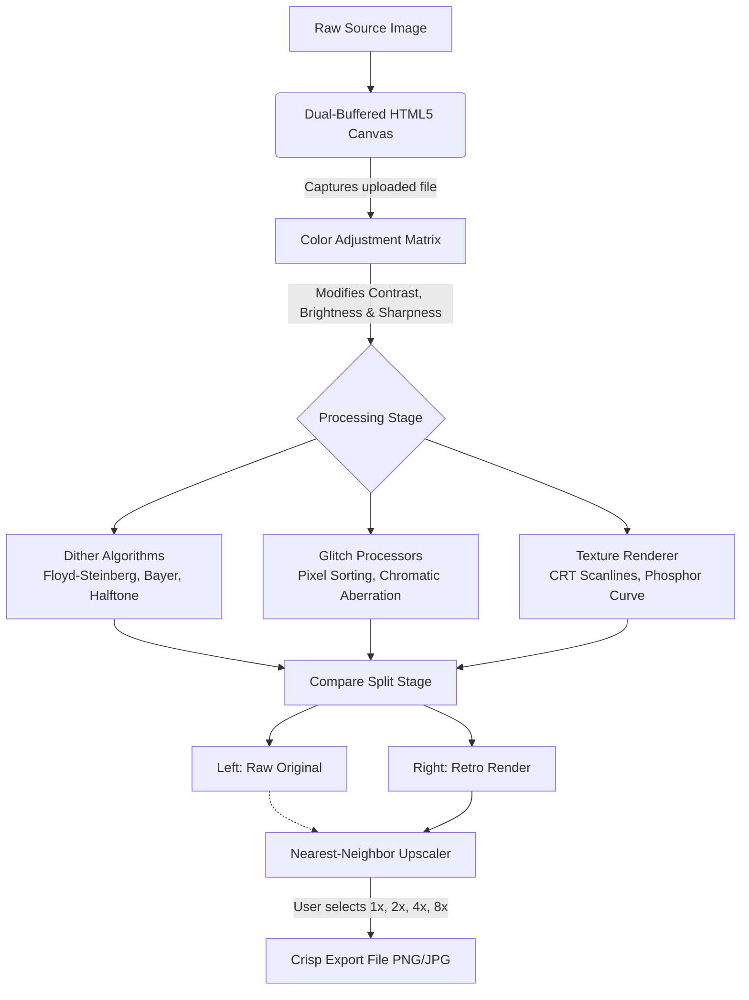

  <h1>RetroLab</h1>
  
<strong>Advanced Pixel, Dither & Glitch Engine</strong>

  

    
    
    
    
    
  

---

## Overview

**RetroLab** is an offline-first, high-performance image processing station built directly in the browser. It allows designers, artists, and game developers to instantly downgrade high-fidelity modern images into gorgeous retro formats, custom pixel art, and digital glitch matrices.

> **Core Philosophy:** By running complex error-diffusion and pixel manipulation algorithms entirely on the client-side via HTML5 Canvas and `Uint8ClampedArray`, RetroLab guarantees absolute data privacy with zero server bandwidth utilization, while providing an immersive, lag-free 60FPS workspace.

---

## ⚡ Measurable Performance Metrics

RetroLab executes all rendering client-side, bypassing traditional server-side processing queues. This architecture yields the following benchmarks:

*   **⚡ Client-Side Only**: 0% server bandwidth utilization. Images never leave the user's computer.
*   **⏱️ <16ms Preview Updates**: Re-calculates and re-draws complex Floyd-Steinberg diffusion loops within a single frame budget, keeping the screen fluid.
*   **🎮 60 FPS Interactive Scrubbing**: Dial-parameters (such as luma contrast, bayer scale, and scanlines) update instantly as sliders are dragged.
*   **💾 Offline Capable**: Zero network calls required for core rendering. Works seamlessly in remote or low-bandwidth environments.
*   **🖼️ Native Canvas Core**: Processes up to 4K raw image sources by isolating pixel clusters into structured Float32 clamped arrays.

---

## 🏗️ Dynamic Pipeline Schematic

The following diagram illustrates how raw image files transition from source uploads to optimized retro-rendered files:

---

## 🧠 Core Algorithms Explained

RetroLab packs several specialized algorithms to recreate authentic retro aesthetics:

### Dithering Techniques
*   **Floyd-Steinberg Dithering**: Spreads quantization error to neighboring pixels (right, lower-left, lower, lower-right). Produces organic, noise-like pointillism textures.
*   **Ordered Bayer (4x4 & 8x8)**: Uses repeating threshold matrices to recreate retro game displays. Produces clean cross-hatched and checkered grids typical of early Macintosh and GameBoy screens.
*   **Halftone Dot Screens**: Simulates classic comic book printing. Groups pixels into larger virtual cells and draws solid circles whose radius is proportional to average luminance, rotated at 45° to avoid harsh lines.

### Glitch & Distortion
*   **Horizontal Pixel Sorting**: Creates digital "melt" and vertical glitch streams. Scans each row, collecting adjacent pixels that exceed a brightness threshold, and sorts their RGB values.
*   **Chromatic Aberration**: Decouples the standard RGBA image buffer into distinct Red, Green, and Blue arrays, offsetting their coordinates to recreate analog lens distortion and misaligned CRT electron guns.

---

## 📱 Responsive & Touch-First Architecture

RetroLab is engineered to provide a premium workspace across all devices:

| Device Layout | Visual Structure | Input Adapters |
| :--- | :--- | :--- |
| **Desktop** | Expanded double-column workspace. Pinned left-side control panel. Interactive dual-buffer canvas stage on the right. | Custom pixel-art cursor. Keyboard-accessible parameter adjustments. |
| **Tablet** | Stacked grid with floating collapsible control panels. Side controls collapse into slide-out drawers. | Swipe-to-scrub adjustments on slider dials. Split-compare panning. |
| **Mobile** | Single-column linear layout. Tabbed, low-height cards. Canvas scales to fit viewport automatically. | Minimized tap targets. Custom pixel cursor auto-disables on touch. |

---

## 💡 Technical Challenges Solved

### 1. Real-Time Preview Rendering
*   **Problem**: Running error-diffusion loops on high-resolution images can block the main UI thread, causing stutter.
*   **Solution**: Implemented **pre-scale controls** that down-sample high-res inputs to working dimensions (e.g., 256px) for live previews, deferring full-resolution rendering until the export phase.

### 2. Preventing Memory Spikes
*   **Problem**: Instantiating new `ImageData` objects inside the processing loop causes frequent garbage collection sweeps.
*   **Solution**: Reused existing canvas buffers and modified pixels **in-place** using clamped `Uint8Array` references, keeping memory allocation completely flat during interactive slider adjustments.

### 3. Crisp Export Scaling
*   **Problem**: Standard CSS or image viewer scaling causes pixel art to blur due to bilinear interpolation.
*   **Solution**: Built a custom offscreen upscaler using **nearest-neighbor scaling** that expands each pixel into a grid of identical pixels, ensuring exports at 2x, 4x, or 8x remain perfectly sharp.

### 4. High-Resolution Feed Performance
*   **Problem**: Fetching many high-resolution community art submissions simultaneously caused UI stuttering.
*   **Solution**: Engineered a custom `<LazyImage />` component with hardware-accelerated **8-bit spin animations and scanlines** that show while loading, preventing blank spaces and creating an immersive experience.

---

## 🚀 Future Roadmap

1. **GPU Acceleration (WebGL)**: Porting dither and sorting algorithms from CPU to GPU fragment shaders (`GLSL`) for real-time 4K video processing at 60fps.
2. **Interactive Palette Builder**: Extract colors from images, edit them individually, and save custom palettes to local storage.
3. **Retro Video Recorder**: Support for processing short video clips or webcam streams to export retro-dithered GIFs and MP4s.
